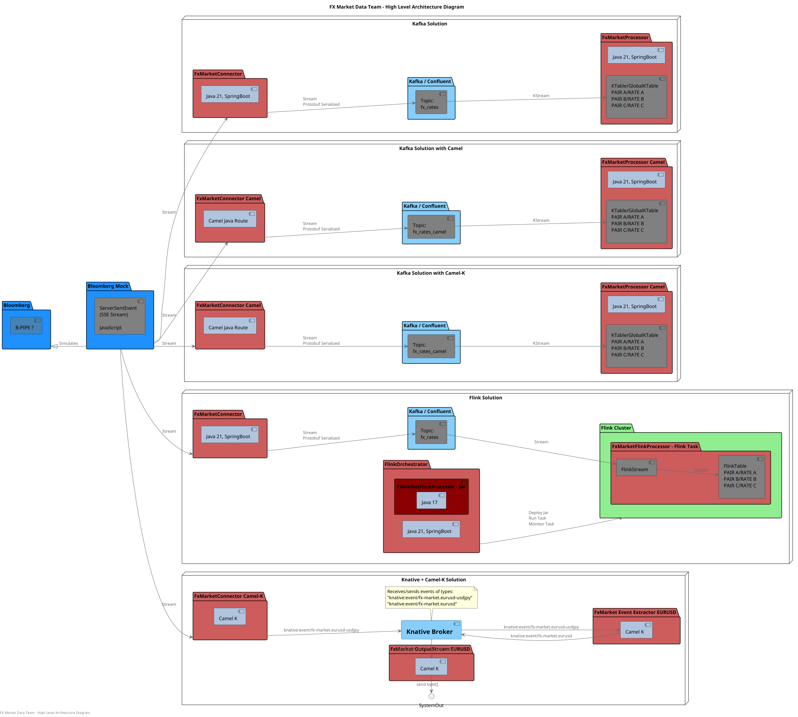
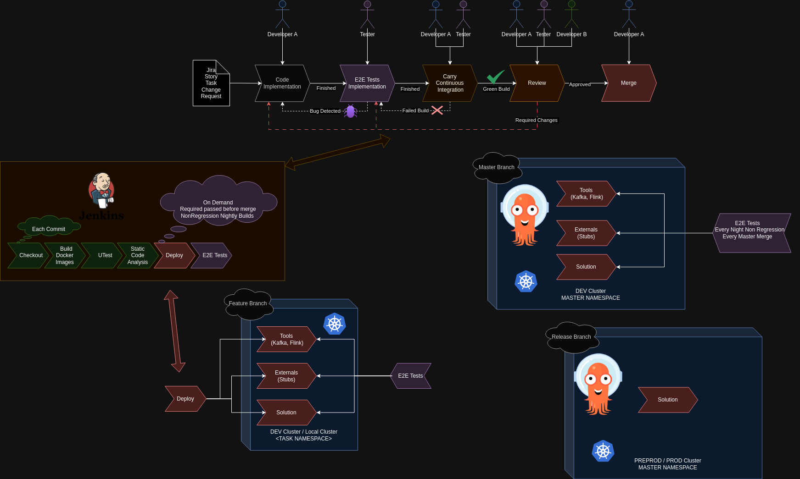

# market-data-processor

> This project was built during the first 4 months of onboarding at a UK Forex/payments company (top-4 card network subsidiary), while awaiting equipment, as a self-study of the domain — by a new team of 3.

> **This is a fork of [Jereczek/market-data-services](https://github.com/Jereczek/market-data-services)**, where the team has worked.

FX market data processing platform — multi-service streaming architecture for foreign-exchange rates, built for production use on Kubernetes.

### Requirements:
- java GraalVm v 21

## To run everything locally:

1) Manual K8s installation
   - Go to `/infra/k8s` and run `./deployAll.sh help`
2) Hybrid K8s installation - Manual tools and solution via ArgoCD
   - Go to `/infra/argo` and run `./deployAllWithArgo.sh help`
3) Docker Compose - **Not fully maintained**
   - Go to `/infra/local` and run `./runWithDockerCompose.sh`

### HighLevel Architecture:

### Development Workflow:

   
### Additional DEV Notes:
- if you are MacOS user, before pushing changes to repo please do
  - `git config --global core.fileMode false` - (it prevents changing files permissions in repo) 
  - `git config --global core.autocrlf input` - (set proper EOF)
  - `git config --global core.autocrlf input`
