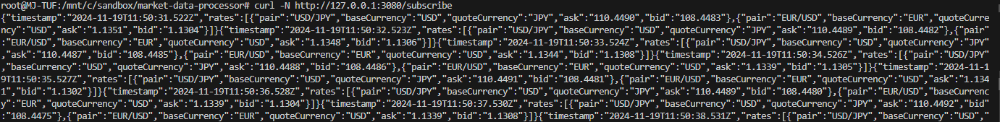

Dummy FX Market Data Stub

It streams dummy FX Rates via SSE protocol

1. Run locally:
    `npm install`
    `node index.js`

2. Run on docker:

    Podman:
    - `podman build -t market-data-stub . --load`
    - `podman run -d -p  3080:3080 --name fx-market-stub market-data-stub`

    Docker:
    - `docker build -t market-data-stub . --load`
    - `docker run -d -p 3080:3800 --name fx-market-stub market-data-stub`

3. Expected result from host machine or inside container:


4. Sample record:
    ```
    {
        "timestamp":"2024-11-19T11:50:31.522Z",
        "rates":
        [
            {
                "pair":"USD/JPY",
                "baseCurrency":"USD",
                "quoteCurrency":"JPY",
                "ask":"110.4490",
                "bid":"108.4483"
            },
            {
                "pair":"EUR/USD",
                "baseCurrency":"EUR",
                "quoteCurrency":"USD",
                "ask":"1.1351",
                "bid":"1.1304"
            }
        ]
    }
    ```