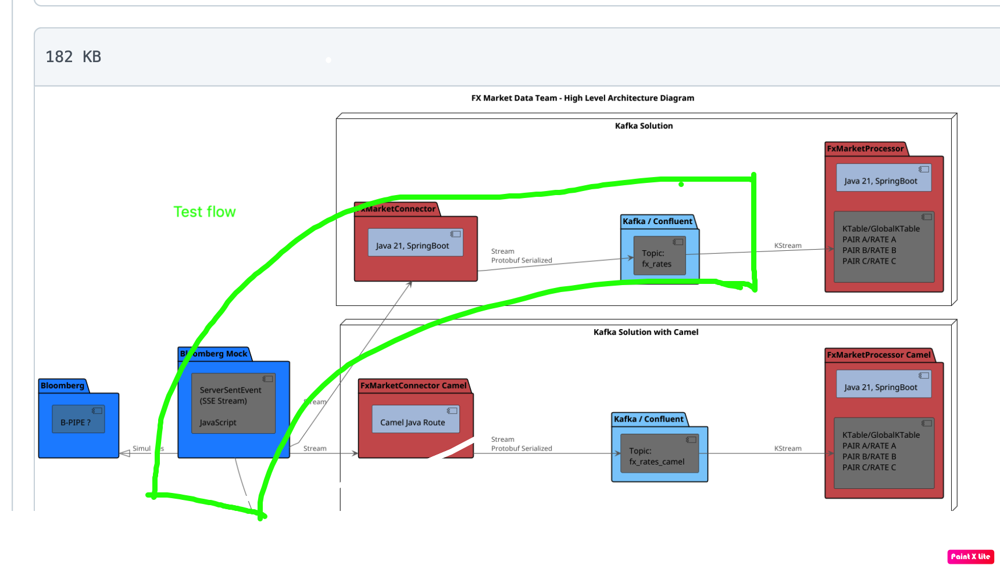
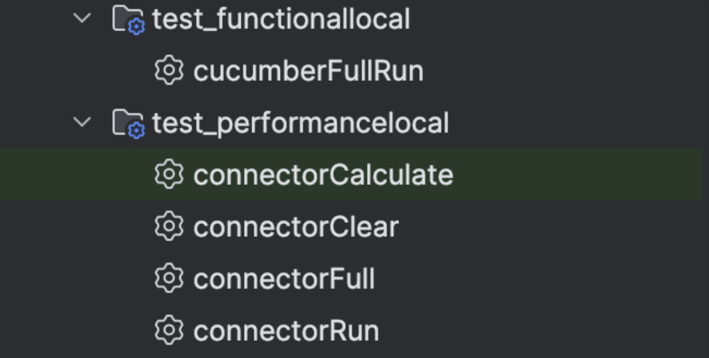

# Test plan for injecting data into Kafka
Test Plan for Stub -> Connector -> Kafka in Kubernetes Cluster

---

## Scope of Testing

### What We Are Testing


The focus of this test plan is the **Stub → Connector → Kafka** data flow on the **Kubernetes cluster**.

- **Stub (`fx-market-data-stub`)**: Simulated data source publishing messages.
- **Connector (`fx-market-connector`)**: Receives messages and sends them to Kafka.
- **Kafka (`kafka-0`)**: Stores and processes the received messages.
- **End-to-End Data Flow**: Ensuring messages are properly published, transferred, stored, and consumed.

All requests go through the technical endpoint to simulate events FX Market Data provider 
**`http://localhost:3080/emitEvent`**. 

---

## Test Execution Strategy

### Functional Tests *(using Cucumber)*
- **Verify** data flow across **Stub → Connector → Kafka**.
- **Validate** that messages are correctly published from Stub.
- **Ensure** that Kafka receives and stores the messages as expected.

### Load & Performance Tests *(using k6)*
- Measure message **throughput** and **latency** between Stub and Kafka.
- Stress testing under peak load conditions.

---

## Load Profile Requirement

- The system must handle a **sustained load of 500 RPS** *(over `/emitEvent` endpoint)* for **5 minutes**,  
  without exceeding **95th percentile latency of 3ms**.
- Under a **spike load of 2000 RPS for 1 minute**, the system should **recover within 10 seconds**.
- The system must remain **stable for 1 hour at 300 RPS** without **data loss** or **service crashes**.

---

## **Acceptance Criteria**

### ✅ **Successful Message Delivery**
- The **number of sent messages should be equal to the number of received messages**.

### ⏳ **Latency Requirement**
- **Delta timing** (difference between Kafka message timestamp and event timestamp)  
  must be **less than 3ms for at least 95% of messages**.

### 📊 **Performance Benchmarks**
- **95% of HTTP requests should complete in < 1500 milliseconds**
  ```yaml
  http_req_duration: ['p(95)<1500']
  ```
- **Failure rate of HTTP requests must remain below 5%**
  ```yaml
  http_req_failed: ['rate<0.05']
  ```

### 📜 **Test Reports**
- Generated as an **HTML report** (`html-report.html`)  
  and stored as an **artifact**.

---

## **How to Run Locally**

Run tests via **Gradle Tasks**:
- `local` → Runs **Cucumber functional tests** locally.
- `Full` → Runs all test stages: **calculate, clear, and run**.

---

## **How to Run as a Kubernetes Job**

---


---
## **Next Steps**
- Implement the performance tests as an k8s job
- Automate performance testing within the pipeline
