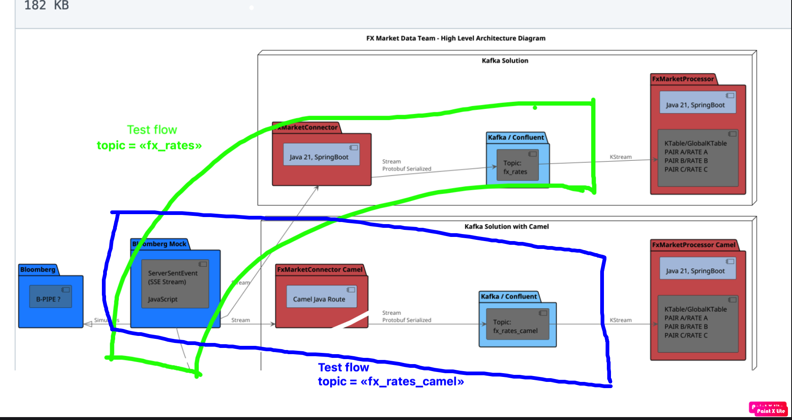

# Performance Testing with k6

This documentation explains how to run performance tests for the `fx-market-data` service using **k6**.
These tests include peak load and stress testing, to check system performance.

---
## **How to Run Tests**

1. 
The Peak Load Test evaluates the system's performance under a high number of concurrent users for a short period.

Just hit needed task:
runPeakLoadTest - running only runPeakLoadTest.js
runPeakLoadTestAndDelta - running runPeakLoadTest.js and calculate Delta timing between message timestamp and kafak timestamp in console
---

## **Test Files**

- `peakLoadTest.js`: Simulates peak load conditions to measure system performance.
- `longStandingTest.js`: Gradually increases the load to determine the system's breaking point.

---

### 2. See the report

Now it's generated as an artifact after performancelocal - Run task.
qa/build/test-results

